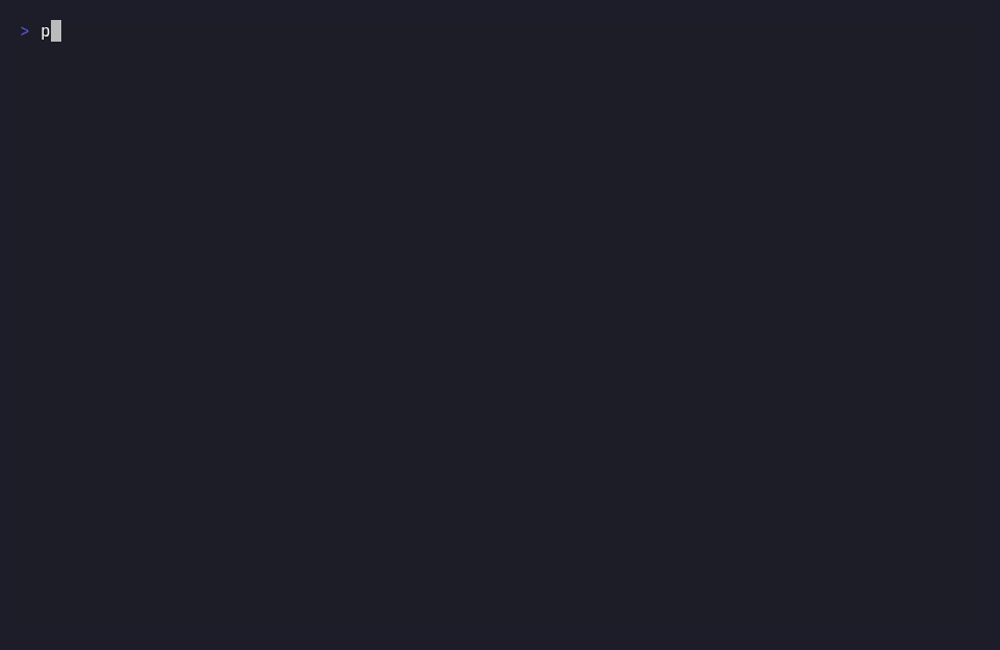
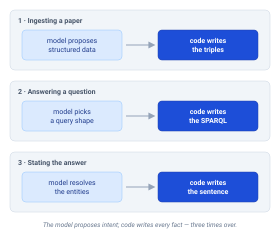

# ML Engineering Knowledge Agent

Most systems that answer questions from documents cite a source and call it grounded. A citation only proves the numbers are real. It says nothing about whether the sentence built from them is true, and I learned that by breaking my own system. Closing that gap is what this project is actually about.

It's a research agent over a curated knowledge graph of ML benchmark results. You ask it something in plain English (*did XGBoost beat TabNet on the Gesture dataset?*) and it answers with the exact figure and where the figure came from: paper, table, page. If the graph doesn't hold the answer, it says so. It never guesses, and it can't invent a number; not because a filter screens the output, but because of how it's wired. The language model never writes a fact.

## The one idea

Three times over: putting a paper in, running a query, stating an answer. The model proposes intent and code writes the formal artifact. The model reads the language coming in; it authors none of the facts going out. A fact that isn't in the graph has no path into an answer, because there is no step where the model holds the pen over an asserted claim.

I reached that design by getting it wrong first. An earlier version let the model write the answer sentence, behind a guard that checked every number in the prose against the retrieved rows. It felt safe. Then I red-teamed it and the guard fell in an afternoon: real numbers, a real citation, and the right method names reassemble into "XGBoost beat TabNet, 0.2 to 0.3", a sentence that's false three ways and passes every check, because provenance of the tokens is not truth of the sentence. A smarter guard is an arms race against language that you lose. Taking the pen out of the model's hand is not. The attacks I ran and how each was closed are in [docs/redteam.md](docs/redteam.md).

## Where it stands, honestly

One paper is fully ingested: Shwartz-Ziv & Armon (2022), 88 benchmark results, every value checked by hand against the source table. The query agent is built and hardened. It retrieves the right result on all 20 evaluation questions and cites the right table on every one that has an answer, and the six attacks that once broke it now run as regression tests. That proves non-fabrication, not breadth. The graph knows one paper deeply and says "not in the graph" to everything else, which is the honest behavior and the point. Adding papers is mechanical work I left until the one-paper answer was trustworthy.

## How it works

A paper enters as a PDF. A vision model reads the results table as an image, which survives the ± symbols, scientific notation, and footnote markers that wreck plain-text extraction, and proposes strict JSON — one record per cell. Code turns that JSON into RDF triples; the model never writes Turtle. Before anything reaches the graph it passes a SHACL gate that rejects a result with no source, a dangling reference, or a metric with no defined direction. Then I review the flagged records by hand. Nothing is auto-committed.

On the query side, the model resolves the entities in your question to canonical URIs, reusing the same alias table the graph already holds, and picks one of four hand-written, tested SPARQL operations (compare, rank, look up, seen-versus-unseen). Code fills the query, runs it read-only, and renders the answer from the verified rows. The model chooses the shape; it never writes the query or the sentence.

The stored unit is a single BenchmarkResult — one method's value, on one dataset, by one metric, with its source. A comparison is never stored. It's derived at query time by matching two results that share a dataset and metric, which handles the N-way tables papers actually print instead of exploding into stored pairs.

## Why RDF and SPARQL

A single SQL table would have answered every query in this repo in a weekend. I chose the heavier semantic-web stack for two honest reasons: I wanted to learn it properly, and provenance and validation are first-class here in a way they aren't in a plain database. SHACL rejects malformed data at the door, and every triple traces to a paper by construction. The cost is real complexity, so I held one rule the whole way through. At every step there had to be a runnable end-to-end path, even with one paper. That rule is what keeps a project like this from turning into a beautiful ontology with nothing inside it.

## Scope

The domain is empirical ML engineering: papers that test methods against each other, or study when a technique works and when it breaks. Supervised-learning comparisons, the effect of data conditions like label noise or class imbalance, training and inference tradeoffs. Not theory papers, and not architecture proposals with no comparison. The corpus grows slowly; a paper earns its place when it adds something the graph doesn't already cover.

## Built, and what's next

Working today: the OWL/RDF ontology on Apache Jena Fuseki, the vision extraction pipeline (one paper through it end to end), a four-layer health harness (SHACL gate, SPARQL invariants, adversarial fixtures, a semantic eval set), and the query agent over both a CLI and a FastAPI endpoint, with its red-team regression suite.

Next: a value-scale decision before the second paper, so a ×100-scaled loss never gets compared against an unscaled one; then more papers. Further out, a vector layer for fuzzier matching and a small web UI. Both roadmap, and not done.

## Stack

| Component | Technology |
|---|---|
| PDF parsing / rendering | PyMuPDF |
| Extraction | Anthropic API (vision) |
| Knowledge graph | OWL/RDF + Apache Jena Fuseki |
| Validation | SHACL + SPARQL invariants |
| Query agent | Anthropic API, tool-use for operation selection |
| Backend | FastAPI |
| Vector store (roadmap) | ChromaDB |

## The reasoning trail

Every decision that wasn't obvious is written down as an ADR in [docs/DECISIONS.md](docs/DECISIONS.md). There are nineteen of them, each with the alternatives I rejected and why. The red-team is in [docs/redteam.md](docs/redteam.md). I built this with AI coding tools doing the mechanical work, but the architecture, the rejected paths, and every commit are mine, and the ADR log is the record of that thinking. If you want to understand why the project is shaped the way it is, start there.

---

*Built by Charalampos (Babis) Giannakis — MSc Business Analytics (Computational Intelligence), Vrije Universiteit Amsterdam.*
